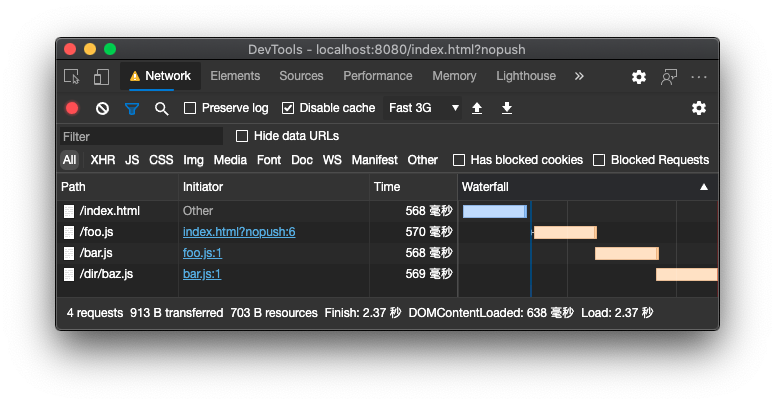
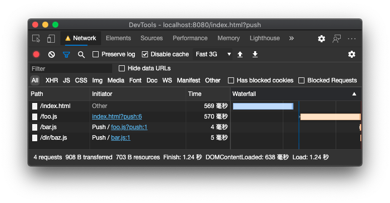

# dependency-push-POC

概念验证项目，在服务端解析 ES 模块文件依赖，并使用 HTTP2 server push 将依赖推送给客户端。避免依赖模块延迟发现导致加载时间延长。

server push off:


server push on:


## 生成自签名 CA 根证书

```bash
openssl req -newkey rsa:2048 -new -nodes -keyout key.pem -out csr.pem
openssl x509 -req -days 365 -in csr.pem -signkey key.pem -out server.crt
```

## 信任根证书

1. 访问站点
2. 从地址栏中打开证书窗口，将证书保存到本地（Mac + Chrome 中拖动到 Finder 中即可）
3. 打开 keychain manager，安装上面保存的证书
4. 调整证书为始终信任
